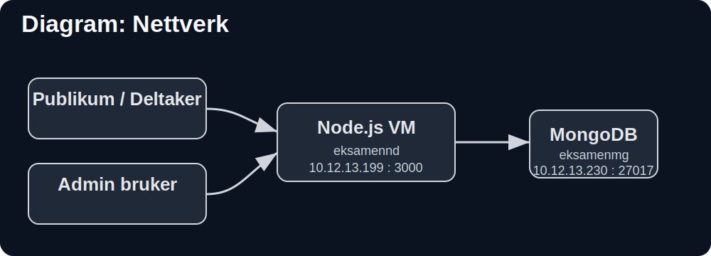
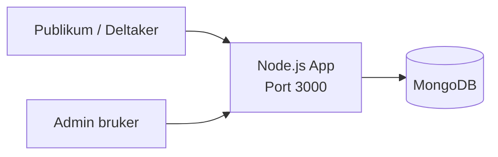
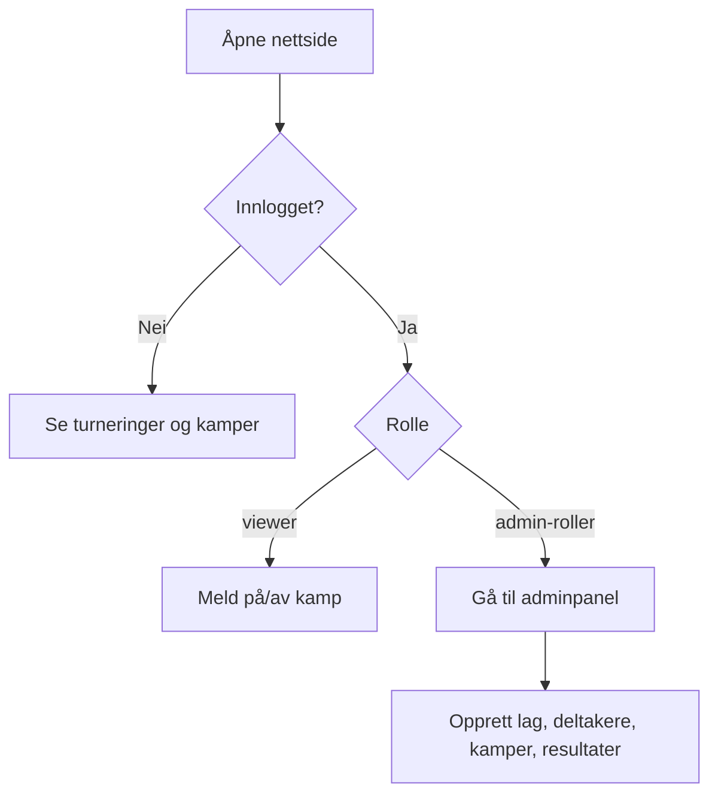

# Vind IL Turneringssystem

Node.js + MongoDB, uten eksterne API-er.

## Krav
- Node.js 20+
- MongoDB 7+

## DNS
- Node.js VM: `eksamennd.vind.lan`
- MongoDB VM: `eksamenmg.vind.lan`

## Oppstart
1. Kopier miljøfil:
   ```bash
   cp .env.example .env
   ```
2. Installer pakker:
   ```bash
   npm install
   ```
3. Lag admin-bruker:
   ```bash
   npm run seed-admin
   ```
4. Start app:
   ```bash
   npm start
   ```

App: `http://localhost:3000`

## Ruter
- Offentlig side: `/`
- Login: `/auth/login`
- Registrering: `/auth/register`
- Admin: `/admin` (kun intern IP + innlogging)

## Roller
- `superadmin`
- `turneringsleder`
- `lagleder`
- `viewer`

## Diagram: Nettverk



Diagrammet viser nettverket:
- Publikum / deltaker bruker nettsiden via Node.js
- Admin bruker går til Node.js via intern tilgang
- Node.js VM: `eksamennd.vind.lan`
- MongoDB VM: `eksamenmg.vind.lan`
- Node.js kobler videre til MongoDB
- MongoDB er ikke direkte tilgjengelig fra internett

## Diagram: Systemarkitektur


## Diagram: Database (ER)
```mermaid
erDiagram
  USER ||--o{ MATCH_SIGNUP : melder_seg_pa
  TEAM ||--o{ PLAYER : har
  TOURNAMENT ||--o{ MATCH : har
  TEAM ||--o{ MATCH : er_hjemmelag
  TEAM ||--o{ MATCH : er_bortelag
  MATCH ||--o{ MATCH_SIGNUP : har_pameldinger

  USER {
    ObjectId _id PK
    string name
    string email UNIQUE
    string passwordHash
    string role
  }

  TEAM {
    ObjectId _id PK
    string name
    string ageGroup
    string managerName
  }

  PLAYER {
    ObjectId _id PK
    ObjectId teamId FK
    string firstName
    string lastName
    date birthDate
    string guardianName
    string guardianPhone
    boolean consentPhoto
  }

  TOURNAMENT {
    ObjectId _id PK
    string title
    string sport
    date startDate
    date endDate
    string location
    string status
  }

  MATCH {
    ObjectId _id PK
    ObjectId tournamentId FK
    ObjectId homeTeamId FK
    ObjectId awayTeamId FK
    date kickoff
    string venue
    string status
    number homeScore
    number awayScore
  }

  MATCH_SIGNUP {
    ObjectId _id PK
    ObjectId matchId FK
    ObjectId userId FK
  }
```

## Diagram: Brukerflyt


## Hvorfor dette oppsettet
- App og database ligger på hver sin VM for å redusere angrepsflaten.
- Kun Node-VM skal snakke direkte med MongoDB.
- MongoDB skal ikke være direkte tilgjengelig fra internett.
- Admin-funksjoner skal bare være tilgjengelige fra skolenett eller VPN.
- Oppsettet følger prinsippet om minste privilegium.

## Tjenester
- `3000/tcp` brukes av Node/Express-appen.
- `27017/tcp` er standardporten til MongoDB.

## Hovedfunksjoner
- Opprette og administrere turneringer
- Opprette lag med kontaktperson
- Registrere deltakere
- Opprette kamper og registrere resultater
- Se kampoppsett og resultater offentlig
- Se egne opplysninger som innlogget deltaker

## Sikkerhet
- SSH-tilgang er satt opp med public keys.
- Admin-ruter er beskyttet med intern nettverkstilgang og innlogging.
- MongoDB er kun ment for appserveren.
- Deltakere ser bare egne data, ikke andres personinformasjon.

## Oppstart lokalt
1. Kopier miljøfil:
   ```bash
   cp .env.example .env
   ```
2. Installer pakker:
   ```bash
   npm install
   ```
3. Lag admin-bruker:
   ```bash
   npm run seed-admin
   ```
4. Start appen:
   ```bash
   npm start
   ```

Appen kjører på `http://localhost:3000`.

## Viktige ruter
- Offentlig side: `/`
- Innlogging: `/auth/login`
- Registrering: `/auth/register`
- Min side: `/me`
- Adminpanel: `/admin`

## Dokumentasjon
- [Nettverksdiagram og IP-plan](docs/IP_NETTVERK_AKTUELL.md)
- [Ekstra diagram med segmenteringsforslag](docs/NETTVERK_IPPLAN_SEGMENTERING.md)
- [Sikkerhetsanalyse](docs/SIKKERHETSANALYSE.md)
- [ER-diagram](docs/ER_DIAGRAM.md)
- [Testprotokoll](docs/TESTPROTOKOLL.md)

## Admin-konto
Standard adminbruker opprettes med:
- e-post: `admin@vindil.local`
- passord: `ChangeMe123!`

Disse verdiene kan overstyres i `.env`.
