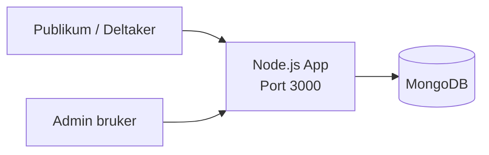
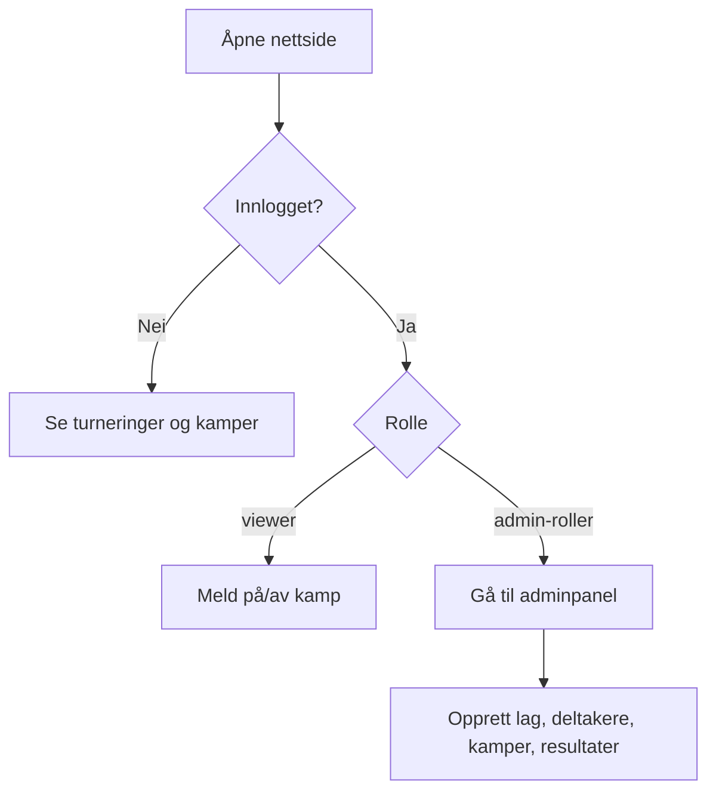

# Vind IL Turneringssystem

Node.js + MongoDB, uten eksterne API-er.

## Krav
- Node.js 20+
- MongoDB 7+

## Oppstart
1. Kopier miljøfil:
   ```bash
   cp .env.example .env
   ```
2. Installer pakker:
   ```bash
   npm install
   ```
3. Lag admin-bruker:
   ```bash
   npm run seed-admin
   ```
4. Start app:
   ```bash
   npm start
   ```

App: `http://localhost:3000`

## Ruter
- Offentlig side: `/`
- Login: `/auth/login`
- Registrering: `/auth/register`
- Admin: `/admin` (kun intern IP + innlogging)

## Roller
- `superadmin`
- `turneringsleder`
- `lagleder`
- `viewer`

## Diagram: Systemarkitektur


## Diagram: Database (ER)
```mermaid
erDiagram
  USER ||--o{ MATCH_SIGNUP : melder_seg_pa
  TEAM ||--o{ PLAYER : har
  TOURNAMENT ||--o{ MATCH : har
  TEAM ||--o{ MATCH : er_hjemmelag
  TEAM ||--o{ MATCH : er_bortelag
  MATCH ||--o{ MATCH_SIGNUP : har_pameldinger

  USER {
    ObjectId _id PK
    string name
    string email UNIQUE
    string passwordHash
    string role
  }

  TEAM {
    ObjectId _id PK
    string name
    string ageGroup
    string managerName
  }

  PLAYER {
    ObjectId _id PK
    ObjectId teamId FK
    string firstName
    string lastName
    date birthDate
    string guardianName
    string guardianPhone
    boolean consentPhoto
  }

  TOURNAMENT {
    ObjectId _id PK
    string title
    string sport
    date startDate
    date endDate
    string location
    string status
  }

  MATCH {
    ObjectId _id PK
    ObjectId tournamentId FK
    ObjectId homeTeamId FK
    ObjectId awayTeamId FK
    date kickoff
    string venue
    string status
    number homeScore
    number awayScore
  }

  MATCH_SIGNUP {
    ObjectId _id PK
    ObjectId matchId FK
    ObjectId userId FK
  }
```

## Diagram: Brukerflyt

