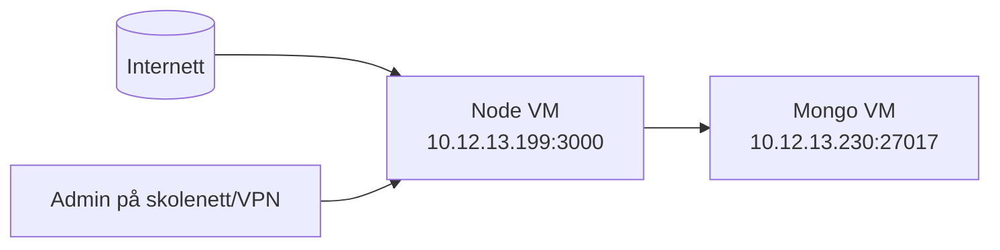

# IP-plan og nettverk (faktisk oppsett)

## VM-er
- Node.js VM: `eksamennd` = `10.12.13.199`
- MongoDB VM: `eksamenmg` = `10.12.13.230`

## Tjenester
- Node-app: port `3000` på `10.12.13.199`
- MongoDB: port `27017` på `10.12.13.230`

## Trafikk som skal være tillatt
- Klient -> Node: `3000/tcp`
- Node (`10.12.13.199`) -> Mongo (`10.12.13.230`): `27017/tcp`
- Admin (skolenett/VPN) -> Node admin-ruter

## Trafikk som skal blokkeres
- Internett direkte -> Mongo `27017`
- Internett direkte -> admin-ruter

## Enkelt nettverksdiagram

## Firewall (anbefalt eksamensversjon)
- På Mongo VM:
  - tillat `from 10.12.13.199 to any port 27017 proto tcp`
  - blokkér andre kilder til `27017`
- På Node VM:
  - tillat `3000/tcp`
  - admin-ruter beskyttes i app med IP-filter + innlogging
