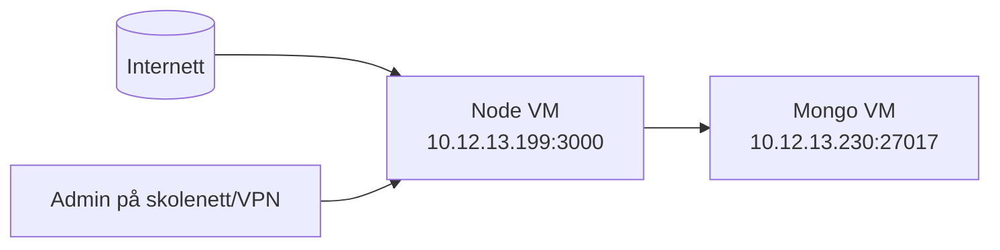

# IP-plan og nettverk (faktisk oppsett)

## VM-er
- Node.js VM: `eksamennd` = `10.12.13.199` = `eksamennd.vind.lan`
- MongoDB VM: `eksamenmg` = `10.12.13.230` = `eksamenmg.vind.lan`

### Hvorfor dette er gjort
- Vi har delt løsningen i to VM-er for å oppfylle kravet om separasjon mellom applikasjon og database.
- Hvis appen får feil eller blir kompromittert, er databasen fortsatt isolert på egen maskin.
- Dette gjør drift enklere: app og database kan restartes/uavhengig ved feil.

## Tjenester
- Node-app: port `3000` på `10.12.13.199`
- MongoDB: port `27017` på `10.12.13.230`

## DNS
- `eksamennd.vind.lan` peker til Node-VM
- `eksamenmg.vind.lan` peker til MongoDB-VM

### Hvorfor disse portene brukes
- `3000` brukes av Node/Express-appen i dette prosjektet.
- `27017` er standard port for MongoDB.
- Standardporter gjør feilsøking og dokumentasjon enklere i skolemiljø.

## Trafikk som skal være tillatt
- Klient -> Node: `3000/tcp`
- Node (`10.12.13.199`) -> Mongo (`10.12.13.230`): `27017/tcp`
- Admin (skolenett/VPN) -> Node admin-ruter

### Hvorfor dette er tillatt
- Klient må nå Node for å bruke nettsiden (turneringer/kamper).
- Node må nå Mongo for å lagre og hente data.
- Admin må nå admin-ruter for å administrere systemet.
- Vi tillater bare trafikk som er nødvendig (minste privilegium).

## Trafikk som skal blokkeres
- Internett direkte -> Mongo `27017`
- Internett direkte -> admin-ruter

### Hvorfor dette blokkeres
- MongoDB inneholder persondata og skal ikke eksponeres direkte.
- Admin-ruter gir høy tilgang (opprette/slette/endre) og må ikke være åpne fra internett.
- Offentlig trafikk skal gå via appen, ikke direkte til database/admin.
- Dette reduserer angrepsflaten betydelig.

## Enkelt nettverksdiagram

### Hvordan lese diagrammet
- Alle brukere går inn via Node-VM.
- Kun Node-VM snakker med Mongo-VM.
- Admin går via skolenett/VPN til Node, ikke direkte til Mongo.
- DNS-navnene brukes nå i stedet for bare IP når det er mulig, for å gjøre oppsettet enklere å lese og vedlikeholde.

## Firewall (anbefalt eksamensversjon)
- På Mongo VM:
  - tillat `from 10.12.13.199 to any port 27017 proto tcp`
  - blokkér andre kilder til `27017`
- På Node VM:
  - tillat `3000/tcp`
  - admin-ruter beskyttes i app med IP-filter + innlogging

### Hvorfor disse reglene er valgt
- Mongo-regel sikrer at bare appserveren kan nå databasen.
- Blokkering av andre kilder beskytter data mot direkte tilgang.
- Node-port åpnes fordi brukere må nå webapplikasjonen.
- Admin er sikret i flere lag:
  1. Nettverk/IP-filter
  2. Innlogging
  3. Rollekontroll i backend

## Kort muntlig forklaring
"Vi har skilt app og database på hver sin VM for sikkerhet og stabilitet. Brukere når bare Node på port 3000. Node når Mongo på port 27017. Databasen er ikke eksponert mot internett, og admin-funksjoner er kun for skolenett/VPN med innlogging og roller."
