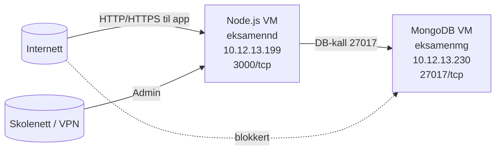

# Nettverksdiagram + IP-plan + forslag til segmentering

## 1) Faktisk løsning i mitt miljø

### Komponenter i nettverket
| Komponent | VM-navn | IP | Porter | Rolle |
|---|---|---|---|---|
| Applikasjon | `eksamennd` | `10.12.13.199` | `3000/tcp` | Kjører Node.js webapp |
| Database | `eksamenmg` | `10.12.13.230` | `27017/tcp` | Kjører MongoDB |
| Admin-klient | Lærer/elev PC | Skolenett/VPN | `22`, `3000` | Drift og administrasjon |

### IP-plan (faktisk)
- Node.js VM: `10.12.13.199`
- MongoDB VM: `10.12.13.230`
- Trafikk som trengs:
  - Klient -> Node: `3000/tcp`
  - Node -> Mongo: `27017/tcp`
- Trafikk som ikke skal være åpen:
  - Internett -> Mongo direkte

### Nettverksdiagram (faktisk)


## 2) Ekstra diagram: slik segmentering kunne sett ut

Hvis nettverkssegmentering ikke er fullt implementert i praksis, kan dette brukes som designforslag.

### Forslått VLAN/IP-plan
| Segment | VLAN | Nett | Eksempel-komponent |
|---|---|---|---|
| DMZ (offentlig web) | 10 | `10.20.10.0/24` | Reverse proxy |
| APP (backend) | 20 | `10.20.20.0/24` | Node.js VM |
| DB (database) | 30 | `10.20.30.0/24` | MongoDB VM |
| ADMIN (drift) | 40 | `10.20.40.0/24` | Admin-PC/VPN |

### Segmenteringsdiagram (forslag)
```mermaid
flowchart LR
  Internet[(Internett)] --> FW[Brannmur/NAT]

  subgraph VLAN10[DMZ - VLAN 10 (10.20.10.0/24)]
    RP[Reverse Proxy\n10.20.10.10]
  end

  subgraph VLAN20[APP - VLAN 20 (10.20.20.0/24)]
    APP[Node.js App\n10.20.20.20:3000]
  end

  subgraph VLAN30[DB - VLAN 30 (10.20.30.0/24)]
    DB[MongoDB\n10.20.30.30:27017]
  end

  subgraph VLAN40[ADMIN - VLAN 40 (10.20.40.0/24)]
    ADMIN[Admin-klient/VPN]
  end

  FW --> RP
  RP --> APP
  APP --> DB
  ADMIN --> APP

  Internet -. blokkert .-> APP
  Internet -. blokkert .-> DB
```

### Brannmurregler i forslaget
1. Tillat `Internet -> ReverseProxy:443`
2. Tillat `ReverseProxy -> NodeApp:3000`
3. Tillat `NodeApp -> MongoDB:27017`
4. Tillat `AdminVLAN -> NodeApp:admin`
5. Blokker alt annet som standard
