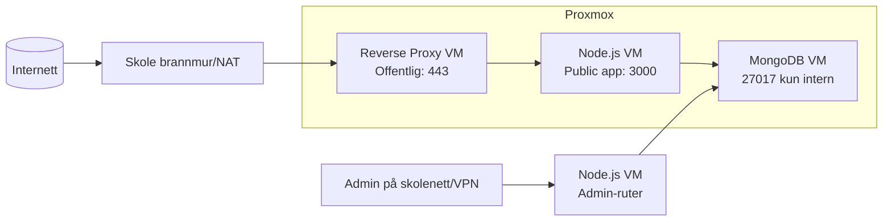

# Turneringssystem for Vind IL (MongoDB + Node.js på Proxmox)

## 1. Avgrensning og premisser
- Ingen eksterne API-er brukes.
- Løsningen kjøres på skolens nettverk i Proxmox.
- App kjører på Node.js-VM på port `3000`.
- MongoDB kjører på egen VM.
- Deltakere skal kunne se kampoppsett/resultater utenfra.
- Admin-grensesnitt skal kun være tilgjengelig internt (skolenett/VPN).

## 2. Brukergrupper, rettigheter og tilgang

### Brukergrupper
1. Superadmin (IT/Driftsansvarlig)
2. Turneringsleder (frivillig ansvarlig)
3. Lagleder
4. Deltaker/Foresatt (lesetilgang)

### Tilgangsmatrise
| Funksjon | Superadmin | Turneringsleder | Lagleder | Deltaker/Foresatt |
|---|---|---|---|---|
| Opprette turnering | Ja | Ja | Nei | Nei |
| Opprette lag | Ja | Ja | Eget lag | Nei |
| Registrere deltakere | Ja | Ja | Eget lag | Nei |
| Sette opp kamper | Ja | Ja | Nei | Nei |
| Føre resultater | Ja | Ja | Kun egne kamper (valgfritt) | Nei |
| Se kampoppsett | Ja | Ja | Ja | Ja |
| Se resultater | Ja | Ja | Ja | Ja |
| Brukeradministrasjon | Ja | Begrenset | Nei | Nei |
| Eksport/sletting av persondata | Ja | Nei | Nei | Nei |

## 3. Datamodell (ER)

```mermaid
erDiagram
  USER ||--o{ MATCH_SIGNUP : melder_seg_pa
  TEAM ||--o{ PLAYER : har
  TOURNAMENT ||--o{ MATCH : har
  TEAM ||--o{ MATCH : er_hjemmelag
  TEAM ||--o{ MATCH : er_bortelag
  MATCH ||--o{ MATCH_SIGNUP : har_pameldinger

  USER {
    objectId _id PK
    string name
    string email UNIQUE
    string passwordHash
    string role
    date createdAt
    date updatedAt
  }

  TEAM {
    objectId _id PK
    string name
    string ageGroup
    string managerName
    date createdAt
    date updatedAt
  }

  PLAYER {
    objectId _id PK
    objectId teamId FK
    string firstName
    string lastName
    date birthDate
    string guardianName
    string guardianPhone
    boolean consentPhoto
    date createdAt
    date updatedAt
  }

  TOURNAMENT {
    objectId _id PK
    string title
    string sport
    date startDate
    date endDate
    string location
    string status
    date createdAt
    date updatedAt
  }

  MATCH {
    objectId _id PK
    objectId tournamentId FK
    objectId homeTeamId FK
    objectId awayTeamId FK
    date kickoff
    string venue
    string status
    number homeScore
    number awayScore
    date createdAt
    date updatedAt
  }

  MATCH_SIGNUP {
    objectId _id PK
    objectId matchId FK
    objectId userId FK
    date createdAt
    date updatedAt
  }
```

## 4. Personvern (alle aldre, inkl. mindreårige)

### Risiko
- Mindreårige deltakere i databasen.
- Kontaktinformasjon kan misbrukes.
- Feil tilgangsstyring kan gi innsyn i persondata.

### Tiltak
1. Dataminimering: lagre kun nødvendige felt.
2. Rollebasert tilgang (RBAC) i backend.
3. Passord hashet med `bcrypt`.
4. HTTPS på offentlig side (reverse proxy med TLS).
5. Admin-panel kun internt/VPN, ikke publisert mot internett.
6. Logging av innlogging og endringer i resultater.
7. Rutine for innsyn, retting og sletting av persondata.
8. Egen samtykkeløsning for bilder/publisering for mindreårige.
9. Backup krypteres og lagres med tilgangskontroll.

## 5. Driftarkitektur (Proxmox)



### Krav oppfylt
- Deltakerside eksponeres utad via reverse proxy.
- Adminside er kun intern (IP-filter/VPN + firewall-regler).

## 6. IP-plan (eksempel)

| Komponent | VLAN/Nett | IP | Port(er) | Tilgjengelig fra |
|---|---|---|---|---|
| Reverse Proxy VM | 10.20.10.0/24 (DMZ) | 10.20.10.10 | 80,443 | Internett |
| Node.js VM | 10.20.20.0/24 (APP) | 10.20.20.20 | 3000 | Reverse proxy + intern admin |
| MongoDB VM | 10.20.30.0/24 (DB) | 10.20.30.30 | 27017 | Kun Node.js VM |
| Admin-klienter | 10.20.40.0/24 (ADMIN) | DHCP/statisk | 443/3000 | Kun internt/VPN |

### Brannmurregler (minimum)
1. Internett -> Reverse Proxy: tillat 443.
2. Internett -> Node/Mongo: blokkér alt.
3. Reverse Proxy -> Node: tillat 3000.
4. Node -> Mongo: tillat 27017.
5. Admin-nett -> Node admin-endepunkt: tillat.
6. Alle andre flyter: blokkér som standard.

## 7. Hva skjer ved feil, og risikoreduserende tiltak

### Scenario A: Node.js VM går ned
- Effekt: nettside utilgjengelig.
- Tiltak: systemd auto-restart, overvåking (uptime check), rask restore fra VM-snapshot.

### Scenario B: MongoDB VM går ned
- Effekt: ingen registrering/resultatoppdatering, ev. lesefeil.
- Tiltak: daglig backup (`mongodump`), dokumentert restore-prosedyre, snapshots før større endringer.

### Scenario C: Reverse proxy feiler
- Effekt: ekstern tilgang nede, intern kan fortsatt virke.
- Tiltak: enkel reserveproxy eller hurtig reinstall via dokumentert konfig.

### Scenario D: Feilregistrerte resultater
- Effekt: feil tabell/oppgjør.
- Tiltak: endringslogg + «to-trinns bekreftelse» for publisering av resultat.

## 8. Kort brukerveiledning (frivillige med lav digital erfaring)

### For lagleder
1. Logg inn med brukernavn/passord.
2. Gå til `Lag` -> `Nytt lag`.
3. Legg inn spillere (navn + fødselsdato).
4. Trykk `Meld på turnering`.
5. Sjekk fanen `Kamper` for tid og bane.

### For turneringsleder
1. Opprett turnering (dato, sport, sted).
2. Godkjenn påmeldte lag.
3. Generer kampoppsett.
4. Registrer resultater fortløpende.
5. Kontroller tabell før publisering.

### For deltakere/foresatte
1. Åpne offentlig adresse i nettleser.
2. Velg turnering.
3. Se kampoppsett og resultater uten innlogging.

## 9. Prosjektplan (3 uker, realistisk)

| Uke | Mål | Leveranse |
|---|---|---|
| Uke 1 | Design og grunnoppsett | Brukerroller, ER-diagram, VM-er opprettet, nettverk/firewall klart |
| Uke 2 | Utvikling | Innlogging, lag/deltaker-modul, kampoppsett, resultatregistrering |
| Uke 3 | Test + driftsetting | Systemtest, feilretting, brukerveiledning, backup/restore-test, produksjonssetting |

### Buffer
- Sett av minst 2 dager i uke 3 til feil og forsinkelser.

## 10. Testplan (før produksjon)

### Funksjonelle tester
1. Opprette turnering fungerer.
2. Registrere lag/deltakere fungerer.
3. Kampoppsett vises riktig.
4. Resultatoppdatering oppdaterer visning korrekt.

### Tilgangstester
1. Deltaker kan ikke åpne admin-ruter.
2. Lagleder kan ikke redigere andre lag.
3. Utenfra kan man kun nå offentlig side.

### Driftstester
1. Restart Node-prosess -> app kommer opp automatisk.
2. Restore Mongo-backup til testmiljø verifisert.
3. Brannmurregel testet med portscan fra ekstern klient.

### Akseptansekriterier
- Alle kritiske flyter bestått.
- Ingen høy-risiko sikkerhetsavvik åpne.
- Brukerveiledning testet av minst én frivillig.

## 11. Teknisk gjennomføring uten API-er
- Node.js + Express server-rendered sider (eller enkel frontend), ingen tredjeparts API.
- MongoDB lagrer alle data lokalt i skolemiljø.
- Kun interne tjenester mellom VM-ene.
